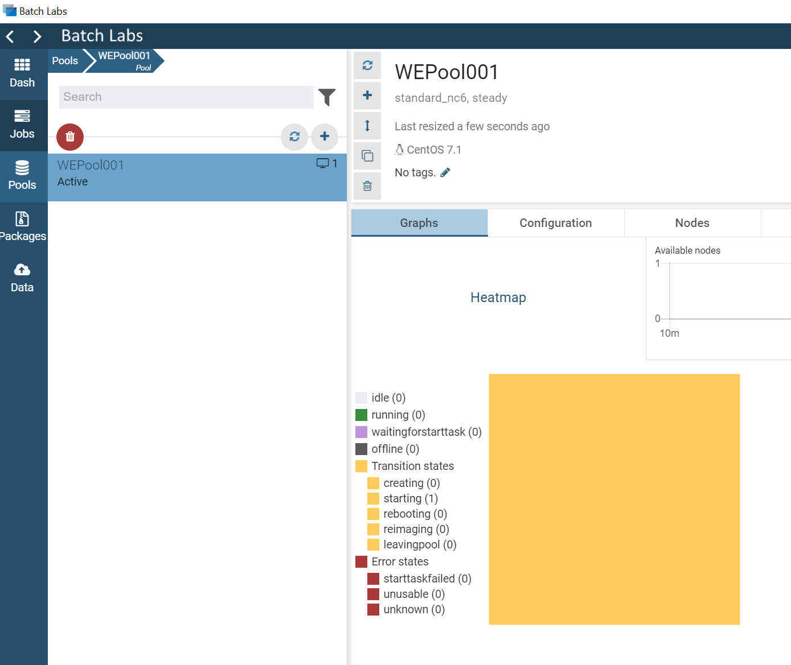
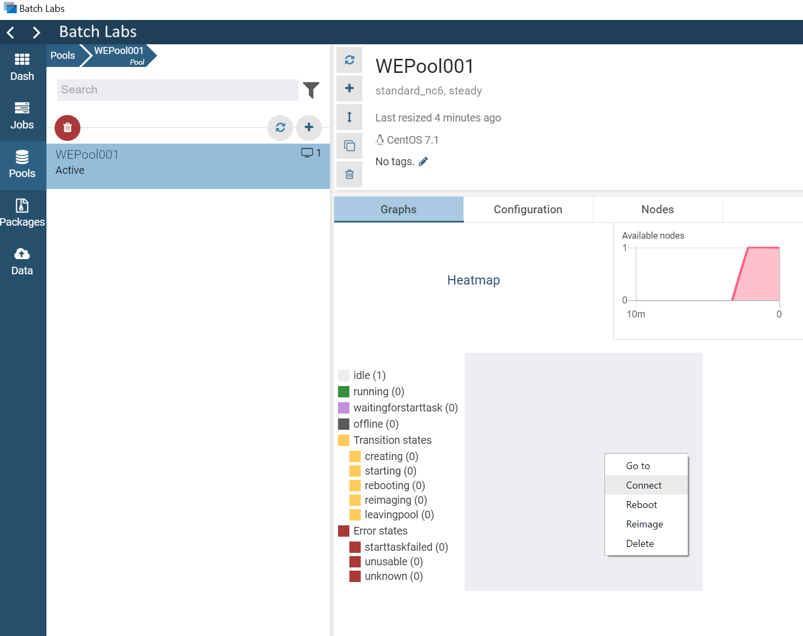

## Recipe 1: Deploying an Azure Batch Custom Image with the Azure CLI

The Azure CLI provides a very simple and convenient method to run Azure Batch without bothering with GUI's or API code. JSON templates make the process even easier, and you can simply define your pools and jobs in templates and run everything from the CLI, or wrap CLI commands into a simple bash script. 

### Pre-Requisites

At the moment some of the features we will be using here are a little big cutting edge, so you'll need to install a few extras. We'll remove this section once these features are folded into the production Azure CLI version. 

Ensure your Azure CLI is installed and has been <a href="https://docs.microsoft.com/en-us/cli/azure/install-azure-cli?view=azure-cli-latest">updated to the latest version.</a>

Check your current Azure CLI version with: 
```
$ az --version | more
azure-cli (2.0.21)
acr (2.0.15)
acs (2.0.19)
appservice (0.1.20)
backup (1.0.3)
batch (3.1.7)  <<< ensure you have version 3.1.7 or above of the batch module.>>>
```
In order to gain access to the latest features required to use custom images with Azure Batch, you'll also need to upgrade to a developer (edge) version of the Azure CLI. More detailed instructions are available on the <a href=https://github.com/Azure/azure-cli>azure batch cli github</a>.

Note the recommendation to use virtualenv, but you can also simply do: 
```
$ sudo pip install --pre azure-cli --extra-index-url https://azurecliprod.blob.core.windows.net/edge
```
### Preparing for your first deployment

At a high level the process is as follows: 

1) Create a resource group, storage account and batch account in your region of choice. 
2) Ensure you have sufficient core count quota. 
3) Create a Service Principal for your Azure Batch "application" service. 
4) Prepare your Custom Image
5) Create your JSON Pool Template
6) AAD Login to your Azure Batch account
7) Create your Azure Batch Pool from the CLI
8) Expand the pool with Azure CLI or Azure Batch Labs. 
9) Login in and test your image. 

### Quickstart Guide

If you are just looking for the commands you need to run in sequence, here it is: 
```
$ az group create --name mkbatchwegrp --location westeurope --output json
$ az storage account create --location westeurope --name mkbatchwestore --sku Standard_LRS --resource-group mkbatchwegrp --output json
$ az batch account create --name mkbatchwe --location westeurope --storage-account mkbatchwestore --r mkbatchwegrp --output json
$ az batch account show --name mkbatchwe --resource-group mkbatchwegrp --output json
$ az ad sp create-for-rbac --name mkbatchappwe --output json
$ az image create --resource-group mkbatchwegrp --name CHPCLinux --source https://mkbatchwestore.blob.core.windows.net/batchfiles image.vhd --os-type Linux --location westeurope --output json
$ az batch account login --resource-group mkbatchwegrp --name mkbatchwe
$ az batch pool create --json-file pool.json
$ az batch pool list --output json
$ az batch pool list --output json | grep id
$ az batch pool resize --pool-id WEPool001 --target-dedicated-nodes 1
```
Note that you are also free to perform some or all of these steps in the Azure Portal. 

## Detailed Instructions

### 1) Create a resource group, storage account and batch account in your region of choice: 
```
$ az group create --name mkbatchwegrp --location westeurope --output json
$ az storage account create --location westeurope --name mkbatchwestore --sku Standard_LRS --resource-group mkbatchwegrp --output json
$ az batch account create --name mkbatchwe --location westeurope --storage-account mkbatchwestore --r mkbatchwegrp --output json
```

### 2) Ensure you have sufficient core count quota 

By default an Azure batch account will default to a core quota of just 20 cores (this is a safety feature). If you need more, or access to skus that are not available in your subscription, you will need to open a help ticket via the <a href=portal.azure.com>Azure Portal</a>. You can follow <a href=https://docs.microsoft.com/en-us/azure/azure-supportability/resource-manager-core-quotas-request>this article</a> which shows how to open the ticket and request a core quota increase per SKU & region for your subscription. Azure Batch has it's own core quota so you'll need to follow the instructions there, but select "Quota Type = Batch" instead of "Quota Type = Cores" in the drop down menu. Then just manually fill out in the text box what SKU's you need enabled in which region, and the helpdesk team will respond to your request. 
```
$ az batch account show --name mkbatchwe --resource-group mkbatchwegrp --output json

 "accountEndpoint": "mkbatchwe.westeurope.batch.azure.com",
 "activeJobAndJobScheduleQuota": 20,
 "autoStorage": {
   "lastKeySync": "2017-11-17T19:59:29.597579+00:00",
   "storageAccountId": "/subscriptions/XXXXXXXX-XXXX-XXXX-XXXX-XXXXXXXXXXXX/resourceGroups/mkbatchwegrp/providers/Microsoft.Storage/storageAccounts/mkbatchwestore"
 },
 "dedicatedCoreQuota": 20,
 "id": "/subscriptions/XXXXXXXX-XXXX-XXXX-XXXX-XXXXXXXXXXXX/resourceGroups/mkbatchwegrp/providers/Microsoft.Batch/batchAccounts/mkbatchwe",
 "keyVaultReference": null,
 "location": "westeurope",
 "lowPriorityCoreQuota": 20,
 "name": "mkbatchwe",
 "poolAllocationMode": "BatchService",
 "poolQuota": 20,
 "provisioningState": "Succeeded",
 "resourceGroup": "mkbatchwegrp",
 "tags": null,
 "type": "Microsoft.Batch/batchAccounts"

```

### 3) Create a Service Principal for your Azure Batch "application" service. 
```
$ az ad sp create-for-rbac --name mkbatchappwe --output json
{
 "appId": "XXXXXXXX-XXXX-XXXX-XXXX-XXXXXXXXXXXX",
 "displayName": "mkbatchappwe",
 "name": "http://mkbatchappwe",
 "password": "XXXXXXXX-XXXX-XXXX-XXXX-XXXXXXXXXXXX",
 "tenant": "XXXXXXXX-XXXX-XXXX-XXXX-XXXXXXXXXXXX"
}
```
Do save this output somewhere as you will need these values for your python script in recipe 2. 

### 4) Prepare your Custom Image

Ensure you have uploaded your Custom OS Image as a VHD file to a storage account in the same region where you want to create the Azure Custom Image. You can use tools such as azcopy or storageexplorer to do this. You will need to upload the file to a general purpose storage account (not a blob storage account) as it is stored as a "page blob". 

Once uploaded, you will need the URL for the image.vhd file you have uploaded to your storage blob container, and then you can create the Custom Image as follows: 
```
$ az image create --resource-group mkbatchwegrp --name CHPCLinux --source https://mkbatchwestore.blob.core.windows.net/batchfiles image.vhd --os-type Linux --location westeurope --output json

 "id": "/subscriptions/XXXXXXXX-XXXX-XXXX-XXXX-XXXXXXXXXXXX/resourceGroups/mkbatchwegrp/providers/Microsoft.Compute/images/CHPCLinux",
 "location": "westeurope",
 "name": "CHPCLinux",
 "provisioningState": "Succeeded",
 "resourceGroup": "mkbatchwegrp",
 "sourceVirtualMachine": null,
 "storageProfile": {
   "dataDisks": [],
   "osDisk": {
     "blobUri": "https://mkbatchwestore.blob.core.windows.net/batchfiles/image.vhd",
     "caching": "None",
     "diskSizeGb": 31,
     "managedDisk": null,
     "osState": "Generalized",
     "osType": "Linux",
     "snapshot": null,
     "storageAccountType": "Standard_LRS"
   }
 },
 "tags": {},
 "type": "Microsoft.Compute/images"

```
The "id" field is the path to the image that we will use in both the JSON configuration file and the Python script in recipe 2. 

#### 5) Create your JSON Pool Template

Create your Azure CLI input JSON template as follows. In this case our Custom Image is based on CentOS 7.1: 
```
$ cat pool.json
{
        "id": "WEPool001",
        "vmSize": "Standard_NC6",
        "virtualMachineConfiguration": {
            "imageReference": {
                "virtual_machine_image_id": "/subscriptions/XXXXXXXX-XXXX-XXXX-XXXX-XXXXXXXXXXXX/resourceGroups/mkbatchwegrp/providers/Microsoft.Compute/images/CHPCLinux",
                "publisher": "OpenLogic",
                "offer": "CentOS",
                "sku": "7.1"
            },
            "nodeAgentSKUId": "batch.node.centos 7"
        },
        "targetDedicatedNodes": 0
}
```
Note that this template will create a pool with zero nodes (targetDedicatedNodes), so once it's created you can simply expand the pool to as many nodes as you want via the cli, python, batch labs or the azure portal. The pool can sit at zero nodes so you've no need to destroy and create it each time you start a job. 

#### 6) AAD Login to your Azure Batch account
```
$ az batch account login --resource-group mkbatchwegrp --name mkbatchwe
```
#### 7) Create your Azure Batch Pool from the CLI
```
$ az batch pool create --json-file pool.json
```
Check the pool was created successfully: 

```
$ az batch pool list --output json
[
  {
    "allocationState": "steady",
    "allocationStateTransitionTime": "2017-11-18T05:50:38.838034+00:00",
    "applicationLicenses": null,
    "applicationPackageReferences": null,
    "autoScaleEvaluationInterval": null,
    "autoScaleFormula": null,
    "autoScaleRun": null,
    "certificateReferences": null,
    "cloudServiceConfiguration": null,
    "creationTime": "2017-11-18T05:50:38.061875+00:00",
    "currentDedicatedNodes": 0,
    "currentLowPriorityNodes": 0,
    "displayName": null,
    "eTag": "0x8D52E484B6AFC06",
    "enableAutoScale": false,
    "enableInterNodeCommunication": false,
    "id": "WEPool001",
    "lastModified": "2017-11-18T05:50:38.061875+00:00",
    "maxTasksPerNode": 1,
    "metadata": null,
    "networkConfiguration": null,
    "resizeErrors": null,
    "resizeTimeout": "0:15:00",
    "startTask": null,
    "state": "active",
    "stateTransitionTime": "2017-11-18T05:50:38.061875+00:00",
    "stats": null,
    "targetDedicatedNodes": 0,
    "targetLowPriorityNodes": 0,
    "taskSchedulingPolicy": {
      "nodeFillType": "spread"
    },
    "url": "https://mkbatchwe.westeurope.batch.azure.com/pools/WEPool001",
    "userAccounts": null,
    "virtualMachineConfiguration": {
      "imageReference": {
        "offer": "CentOS",
        "publisher": "OpenLogic",
        "sku": "7.1",
        "version": "latest"
      },
      "nodeAgentSkuId": "batch.node.centos 7",
      "osDisk": null,
      "windowsConfiguration": null
    },
    "vmSize": "standard_nc6"
  }
]
```
#### 8) Resize the Pool

Note that in Step 5 we could simply set the configuration file value to the number of target nodes we want eg:
```
"targetDedicatedNodes": 10 
```
However, we can also change the pool size at any time from the CLI. First we need the pool id value: 
```
$ az batch pool list --output json | grep id
    "id": "WEPool001",

$ az batch pool resize --pool-id WEPool001 --target-dedicated-nodes 1
```
A few seconds after the resize is initialized, you will see the node appear in Batch Labs and the Azure Portal: 



#### 9) Login and test your Image 

Create an account on the pool node you have created by right clicking on the node in Batch Labs Pool view - click "Connect" as shown in the screenshot here, and then "Generate" or "Specify" the login details for the node. 



Record the credentials, and then login and verify image - in this case we can see the pre-configured NVIDIA drivers are working and the chemistry applications are available where we installed them: 
```
mk@batchtop:~/CHPC$  ssh fgfele@13.92.137.156 -p 50000
The authenticity of host '[13.92.137.156]:50000 ([13.92.137.156]:50000)' can't be established.
ECDSA key fingerprint is SHA256:RIDpQTcdVmiF1+rCrSwRwiHy8D883HmWgJufY1v9vFM.
Are you sure you want to continue connecting (yes/no)? yes
Warning: Permanently added '[13.92.137.156]:50000' (ECDSA) to the list of known hosts.
Password:
[fgfele@5a7425e38ba948a2b3814afaead19078000000 ~]$ ls /opt
amber  batch  cmake  gcc  gromacs  namd  rh
[fgfele@5a7425e38ba948a2b3814afaead19078000000 ~]$
[fgfele@5a7425e38ba948a2b3814afaead19078000000 opt]$ nvidia-smi
Sun Oct  8 17:03:37 2017
+-----------------------------------------------------------------------------+
| NVIDIA-SMI 375.26                 Driver Version: 375.26                    |
|-------------------------------+----------------------+----------------------+
| GPU  Name        Persistence-M| Bus-Id        Disp.A | Volatile Uncorr. ECC |
| Fan  Temp  Perf  Pwr:Usage/Cap|         Memory-Usage | GPU-Util  Compute M. |
|===============================+======================+======================|
|   0  Tesla K80           Off  | B413:00:00.0     Off |                    0 |
| N/A   42C    P0    61W / 149W |      0MiB / 11439MiB |     78%      Default |
+-------------------------------+----------------------+----------------------+

+-----------------------------------------------------------------------------+
| Processes:                                                       GPU Memory |
|  GPU       PID  Type  Process name                               Usage      |
|=============================================================================|
|  No running processes found                                                 |
+-----------------------------------------------------------------------------+
[fgfele@5a7425e38ba948a2b3814afaead19078000000 opt]$
```
